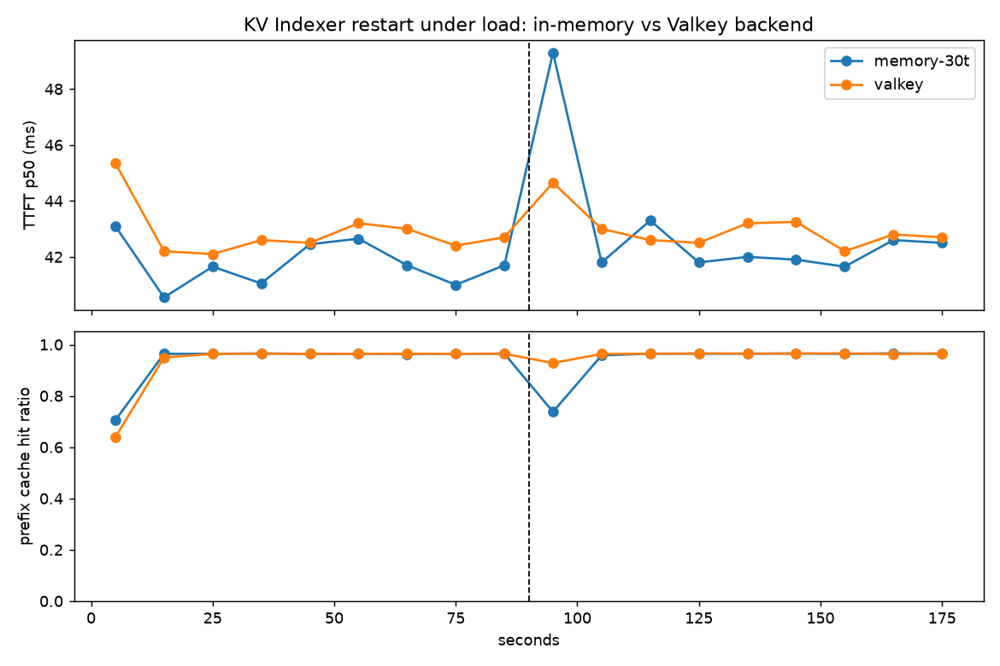
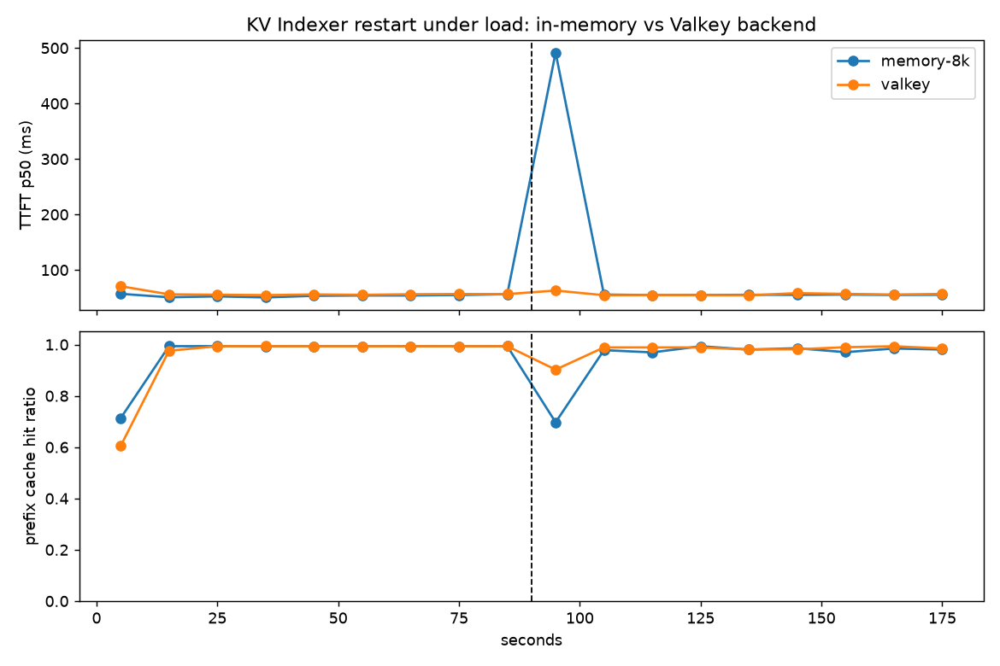

# SGLang KV Indexer on Valkey: restart-safe cache-aware routing

SGLang's router can route each request to the worker that already holds the
longest prefix of its KV cache. In a fleet, that placement knowledge lives in the
KV Indexer, a gRPC service fed by every worker's KV events. Until now the Indexer
kept its index in process memory: one server per deployment, and a restart or
deploy blanked the index. Hot prefixes (system prompts, tool schemas) are stored
once at worker start and never re-emitted, so a fresh Indexer never learns them.
The router falls back to load-based routing, half the requests land on a worker
without the prefix, and time to first token jumps until every worker has
recomputed every prefix.

This demo runs the same workload twice: once with the in-memory Indexer and once
with the Indexer backed by Valkey, and kills the Indexer server mid-run in both.

## What runs

```text
load.py  ->  sgl-router (cache_aware, prefix provider = indexer)  ->  2x SGLang workers (Qwen3-1.7B, one RTX 5090)
                    |                                                       |
                    | gRPC MatchExternalKvPrefix                            | ZMQ KV events (BlockStored / BlockRemoved)
                    v                                                       v
             kv-indexer-server  <------------ gRPC ApplyExternalKvBatch -- kv-indexer-bridge (one per worker)
                    |
                    +-- memory:  index dies with the process
                    +-- valkey:  index in a Valkey keyspace, server is stateless
```

- 12 tenants, each with its own system prompt of about 2k tokens, short
  questions, 6 concurrent clients, closed loop.
- `load.py` records time to first token per request and scrapes each worker's
  `sglang:cached_tokens_total` / `sglang:prompt_tokens_total` to compute the
  prefix cache hit ratio per 10 second window.
- At 60 s the Indexer server is killed; at 65 s it is started again with the
  same backend.

## Run

Needs: docker with the NVIDIA runtime, `valkey-server` on PATH, the SGLang
router workspace built in release mode (`cargo build --release -p sgl-router
-p sgl-kv-indexer` in `experimental/sgl-router`), and the model in the local
HF cache.

```sh
./up.sh                      # valkey + two workers, waits for health
./scenario.sh memory         # ~2.5 min
./scenario.sh valkey         # ~2.5 min
python3 report.py ~/.cache/sglang-valkey-demo/results/memory ~/.cache/sglang-valkey-demo/results/valkey \
  --event-at 60 --png results.png
./down.sh
```

`indexer.sh valkey start` brings up two Indexer servers over the same keyspace;
the router is pointed at the first. `KV_INDEXER_BACKEND=valkey` and
`KV_INDEXER_VALKEY_URL` are the only server-side differences from the in-memory
run.

## Results

One RTX 5090, two Qwen3-1.7B workers with 40k-token KV pools each, closed loop
with 6 clients, Indexer server killed at 90 s and restarted 1 s later (a rolling
deploy). Per 10 s window; "blind" is the router's `no_cache_candidate` count for
the whole run.

| run | working set | mode | steady hit ratio | restart window hit ratio | TTFT p50 steady / window | TTFT p90 window | blind decisions |
| --- | --- | --- | --- | --- | --- | --- | --- |
| 30 tenants, 1.5k-token prompts | 47k tokens, above one pool | memory | 0.96 | 0.74 | 42 / 49 ms | 199 ms | 274 |
| | | valkey | 0.96 | 0.93 | 43 / 45 ms | 58 ms | 43 |
| 8 tenants, 7.8k-token prompts | 64k tokens, above one pool | memory | 0.99 | 0.70 | 56 / 492 ms | 1,056 ms | 161 |
| | | valkey | 0.99 | 0.90 | 56 / 63 ms | 523 ms | 25 |

In the long-prompt run the in-memory restart also cut throughput in the window
to 39 requests from about 130; the Valkey-backed one served 93.




What the numbers mean:

- The Valkey window still dips. During the second the server is down the router
  gets no answer and falls back to load-based routing; that is the outage itself,
  and the same for both backends. Two servers over one keyspace remove it
  (`indexer.sh valkey start` runs two; `query_indexer.py` shows they answer byte
  for byte alike), the router just needs to be pointed at the survivor.
- After the restart the in-memory index is empty and only relearns a prefix when
  a worker stores it again, so the router keeps routing blind for prefixes that
  are already resident. Here the working set churns, so it relearns within a
  window. A fleet with hot resident system prompts and little churn stays blind
  far longer: a 12-tenant run whose working set fit both workers logged 893 blind
  decisions over the remaining 90 s, masked only because both workers held every
  prefix.
- The index is small: 2,461 keys and 1.65 MB in Valkey for the 8-tenant fleet,
  about a hundred bytes per block placement.

Reproduce: `./up.sh`, then `LOAD_ARGS="--tenants 8 --prompt-words 7500" DURATION=180
EVENT_AT=90 OUTAGE=1 ./scenario.sh memory` and the same with `valkey`, then
`report.py` on the two result directories.
